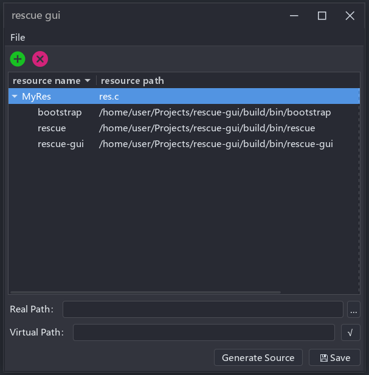

# rescue-gui - A Graphical User Interface for the Cross-Platform Resource Compiler '[rescue](https://github.com/XiaoLey/rescue.git)' with Enhanced Project Management Features

## Description

rescue-gui is a graphical user interface (GUI) program designed to leverage the functionality of `rescue`, a cross-platform resource compiler for C 
and C++. `rescue`, forked from [lukacu/rescue](https://github.com/lukacu/rescue), allows for the conversion of one or more static resource files into a C source file that can be 
compiled into a project, enabling direct access to these resources from memory during runtime. It includes a rudimentary compression capability, judiciously determining whether to compress resources based on their inherent properties, thereby optimizing space utilization.

Building upon this foundation, `rescue-gui` provides a more user-friendly experience by allowing the `rescue` functionalities to be accessed and 
managed through a graphical interface. This GUI is implemented using the [wxWidgets](https://github.com/wxWidgets/wxWidgets) library, a popular tool for 
creating cross-platform applications with native look and feel. The use of `wxWidgets`  facilitates easier navigation and operation, and also makes `rescue` more accessible to those who may be less comfortable with terminal-based operations.

In addition to the core functionalities inherited from `rescue`, `rescue-gui` has introduced a project creation feature. It enables users to save a 
resource management project in a JSON format. This feature is particularly useful for recurring tasks or large projects, as it allows users to 
easily open the project in `rescue-gui` in the future and generate resource compilation files as needed. The JSON parsing functionality in 
`rescue-gui` is powered by the [RapidJSON](https://github.com/Tencent/rapidjson/) library, which provides high-performance JSON processing capabilities.

Please note, though rescue-gui is designed to make using `rescue` easier, it requires `rescue` to function, as it is a GUI extension of the `rescue` program.

## Compiling

The `rescue-gui` project is built using CMake, a versatile tool that enables cross-platform building of projects. Dependency management in the project is handled by [CPM.cmake](https://github.com/cpm-cmake/CPM.cmake), a CMake script for fetching and packaging single-file header-only libraries.

The key dependencies, `rescue`, `wxWidgets`, and `RapidJSON`, have been added to the project as submodules. This approach allows for easy tracking and updating of these dependencies, ensuring that the project can always leverage the latest features and improvements offered by these libraries.

To build the project, one would typically follow these steps:

1. Clone the `rescue-gui` repository, ensuring to also clone submodules (`rescue`, `wxWidgets`, and `RapidJSON`).
2. Run CMake to generate the build system in your preferred development environment.
3. Build the project using the generated build system.

This setup ensures a streamlined build process and simplifies dependency management, thus making it easier for developers to contribute to `rescue-gui`.

## Screenshot

